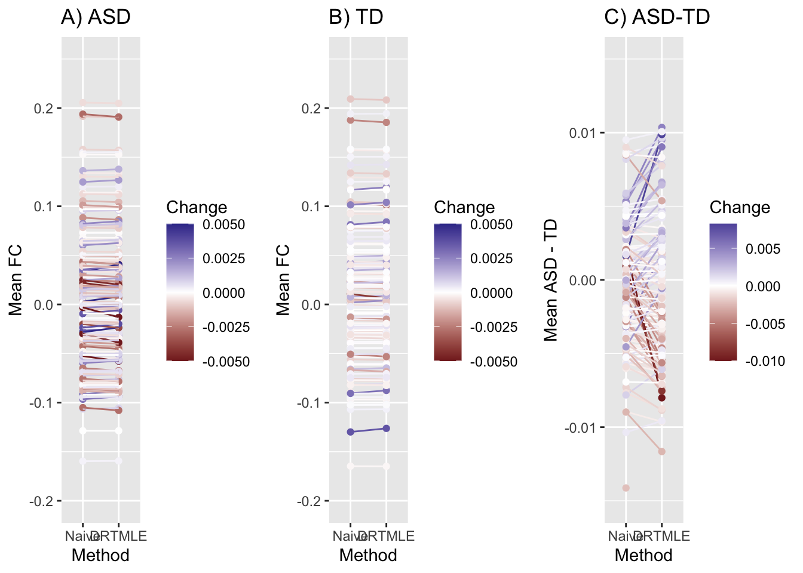
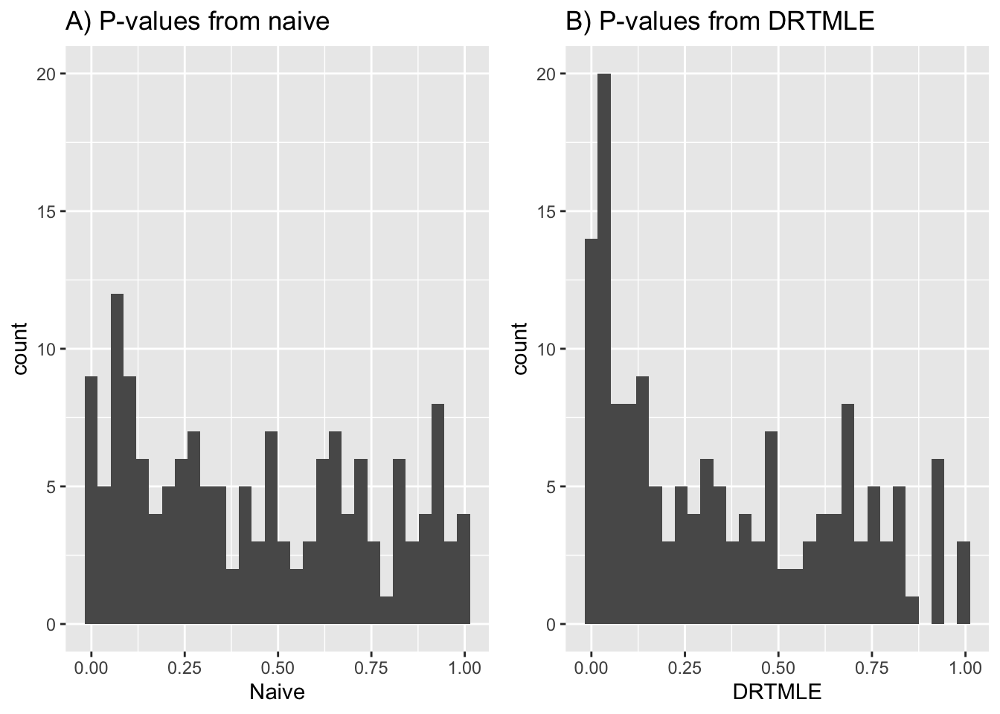
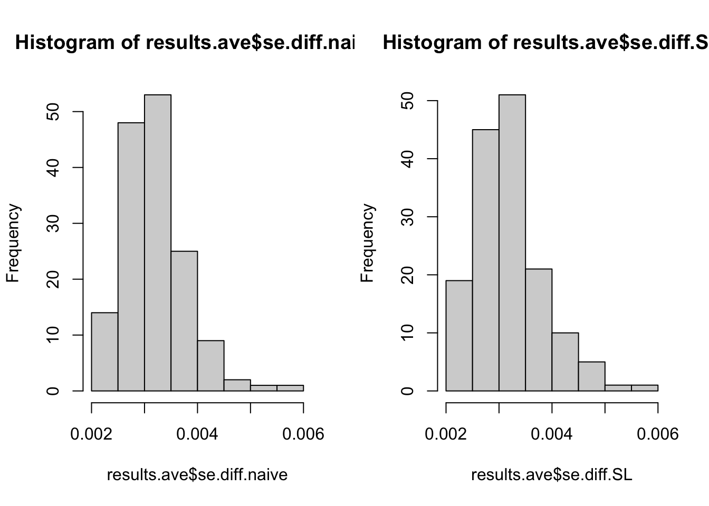
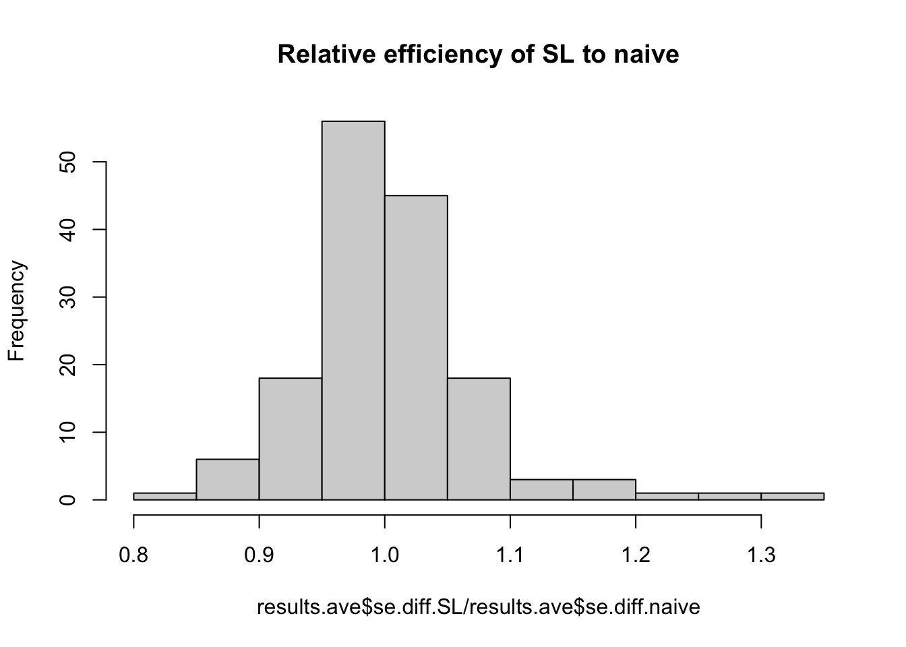
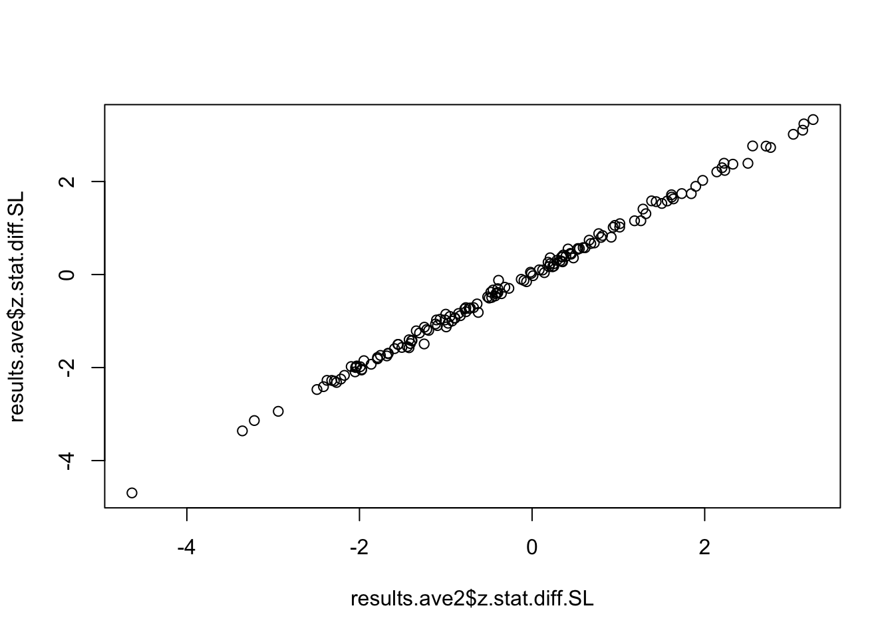
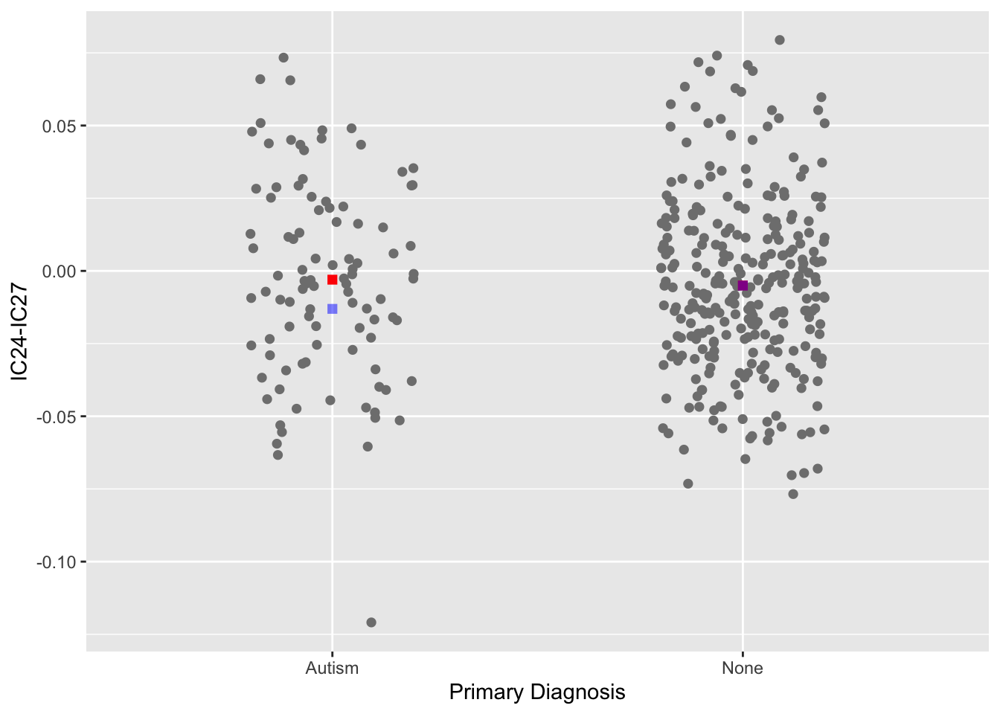

```r
library(ggplot2)
library(wesanderson)
library(tidyverse)
```

```
## ── Attaching packages ─────────────────────────────────────── tidyverse 1.3.1 ──
```

```
## ✓ tibble  3.1.6     ✓ dplyr   1.0.8
## ✓ readr   2.1.2     ✓ stringr 1.4.0
## ✓ purrr   0.3.4     ✓ forcats 0.5.1
```

```
## Warning: package 'dplyr' was built under R version 4.1.2
```

```
## ── Conflicts ────────────────────────────────────────── tidyverse_conflicts() ──
## x purrr::accumulate() masks foreach::accumulate()
## x dplyr::combine()    masks gridExtra::combine()
## x Matrix::expand()    masks tidyr::expand()
## x dplyr::filter()     masks stats::filter()
## x dplyr::lag()        masks stats::lag()
## x Matrix::pack()      masks tidyr::pack()
## x dplyr::slice()      masks xgboost::slice()
## x Matrix::unpack()    masks tidyr::unpack()
## x purrr::when()       masks foreach::when()
```

```r
library(effsize)
library(gridExtra)
library(RColorBrewer)
library(visdat)
# stability plots, plots of the data with the naive and deconfounded mean, 
# plots of the missingness
```

Examine the stability of z-statistics under different seeds:


```r
results.all=NULL
for (i in 1:200) {
  load(paste0('./Results/noImputation/ic30_pc85_glm_gam_drtmle_seed',i,'.RData'))
  results.all = rbind(results.all,results.df)
}
rm(results.df)

# second set of seeds:
results.all2=NULL
for (i in 201:400) {
  load(paste0('./Results/noImputation/ic30_pc85_glm_gam_drtmle_seed',i,'.RData'))
  results.all2 = rbind(results.all2,results.df)
}
rm(results.df)

p=ggplot(data=results.all[order(results.all$z.stat.diff.naive),], aes(x=z.stat.diff.naive, y=z.stat.diff.SL, color=EdgeName))+
  geom_point() + theme(legend.position='none')+geom_abline(slope=1,intercept=0)+
  scale_color_manual(values = colorRampPalette(brewer.pal(n=8,name='Accent'))(153))
```

```r
#library(wesanderson)
```

```r
pdf(file='./Application_Figures/Stability_Assess.pdf')
p
dev.off()
```

```
## quartz_off_screen 
##                 2
```

```r
# Edges of interest from Lombardo:
# edgeList = c('r.ic2.ic17','r.ic8.ic17','r.ic17.ic19')
# results.all[results.all$EdgeName%in%edgeList,]
# three key edges are not significant

# average the z-statistics:
results.ave = results.all%>%
  group_by(EdgeName)%>%
  summarize(mean.ASD.naive=mean(mean.ASD.naive), mean.TD.naive=mean(mean.TD.naive),mean.diff.naive=mean(mean.diff.naive),
            z.stat.ASD.naive=mean(z.stat.ASD.naive),z.stat.TD.naive=mean(z.stat.TD.naive),z.stat.diff.naive=mean(z.stat.diff.naive),
            mean.ASD.SL=mean(mean.ASD.SL),mean.TD.SL=mean(mean.TD.SL),mean.diff.SL=mean(mean.diff.SL),
            z.stat.ASD.SL=mean(z.stat.ASD.SL),z.stat.TD.SL=mean(z.stat.TD.SL),z.stat.diff.SL=mean(z.stat.diff.SL))

results.ave2 = results.all2%>%
  group_by(EdgeName)%>%
  summarize(mean.ASD.naive=mean(mean.ASD.naive), mean.TD.naive=mean(mean.TD.naive),mean.diff.naive=mean(mean.diff.naive),
            z.stat.ASD.naive=mean(z.stat.ASD.naive),z.stat.TD.naive=mean(z.stat.TD.naive),z.stat.diff.naive=mean(z.stat.diff.naive),
            mean.ASD.SL=mean(mean.ASD.SL),mean.TD.SL=mean(mean.TD.SL),mean.diff.SL=mean(mean.diff.SL),
            z.stat.ASD.SL=mean(z.stat.ASD.SL),z.stat.TD.SL=mean(z.stat.TD.SL),z.stat.diff.SL=mean(z.stat.diff.SL))

# compare two estimates:
plot(results.ave$z.stat.diff.SL~results.ave2$z.stat.diff.SL)
```


```r
head(cbind(results.ave$z.stat.diff.SL,results.ave2$z.stat.diff.SL))
```

```
##            [,1]       [,2]
## [1,]  1.5813133  1.5659236
## [2,] -2.4105445 -2.4171422
## [3,] -0.3030594 -0.3970811
## [4,] -0.9387843 -0.8936481
## [5,]  1.4080784  1.2850823
## [6,] -0.1019924 -0.1256482
```

Correlation of z statistics from two sets of 200 seeds across all edges (this result appears in the manuscript):


```r
cor(results.ave$z.stat.diff.SL,results.ave2$z.stat.diff.SL)
```

```
## [1] 0.998773
```

Compare the selected edges at FDR=0.20 and 0.05 in the two sets of seeds:


```r
results.ave$p.SL = 2*(1-pnorm(abs(results.ave$z.stat.diff.SL)))
results.ave$p.SL.fdr = p.adjust(results.ave$p.SL,method='BH')

results.ave2$p.SL = 2*(1-pnorm(abs(results.ave2$z.stat.diff.SL)))
results.ave2$p.SL.fdr = p.adjust(results.ave2$p.SL,method='BH')
```

These results appear in the manuscript:


```r
sum(results.ave$p.SL.fdr<0.05)
```

```
## [1] 6
```

```r
sum(results.ave2$p.SL.fdr<0.05)
```

```
## [1] 6
```

```r
results.ave[results.ave$p.SL.fdr<0.05,c('EdgeName')]
```

```
## # A tibble: 6 × 1
##   EdgeName   
##   <chr>      
## 1 r.ic13.ic26
## 2 r.ic14.ic19
## 3 r.ic14.ic21
## 4 r.ic19.ic26
## 5 r.ic2.ic27 
## 6 r.ic4.ic17
```

```r
results.ave2[results.ave2$p.SL.fdr<0.05,c('EdgeName')]
```

```
## # A tibble: 6 × 1
##   EdgeName   
##   <chr>      
## 1 r.ic13.ic26
## 2 r.ic14.ic19
## 3 r.ic14.ic21
## 4 r.ic19.ic26
## 5 r.ic2.ic27 
## 6 r.ic4.ic17
```

```r
# same seven edges at fdr=0.05

sum(results.ave$p.SL.fdr<0.20)
```

```
## [1] 25
```

```r
sum(results.ave2$p.SL.fdr<0.20)
```

```
## [1] 25
```

```r
edges.20.set1 = results.ave[results.ave$p.SL.fdr<0.2,c('EdgeName','z.stat.diff.SL','p.SL.fdr')]
edges.20.set2 = results.ave2[results.ave2$p.SL.fdr<0.2,c('EdgeName','z.stat.diff.SL','p.SL.fdr')]

cbind(edges.20.set1$EdgeName,edges.20.set2$EdgeName)
```

```
##       [,1]          [,2]         
##  [1,] "r.ic1.ic14"  "r.ic1.ic14" 
##  [2,] "r.ic1.ic21"  "r.ic1.ic21" 
##  [3,] "r.ic1.ic24"  "r.ic1.ic24" 
##  [4,] "r.ic13.ic22" "r.ic13.ic22"
##  [5,] "r.ic13.ic24" "r.ic13.ic24"
##  [6,] "r.ic13.ic25" "r.ic13.ic25"
##  [7,] "r.ic13.ic26" "r.ic13.ic26"
##  [8,] "r.ic14.ic19" "r.ic14.ic19"
##  [9,] "r.ic14.ic21" "r.ic14.ic21"
## [10,] "r.ic14.ic24" "r.ic14.ic24"
## [11,] "r.ic15.ic21" "r.ic15.ic21"
## [12,] "r.ic15.ic30" "r.ic15.ic30"
## [13,] "r.ic17.ic24" "r.ic17.ic24"
## [14,] "r.ic17.ic25" "r.ic17.ic25"
## [15,] "r.ic17.ic27" "r.ic17.ic27"
## [16,] "r.ic19.ic21" "r.ic19.ic21"
## [17,] "r.ic19.ic24" "r.ic19.ic24"
## [18,] "r.ic19.ic25" "r.ic19.ic25"
## [19,] "r.ic19.ic26" "r.ic19.ic26"
## [20,] "r.ic2.ic27"  "r.ic2.ic27" 
## [21,] "r.ic21.ic30" "r.ic21.ic30"
## [22,] "r.ic26.ic30" "r.ic26.ic30"
## [23,] "r.ic4.ic17"  "r.ic4.ic17" 
## [24,] "r.ic4.ic21"  "r.ic4.ic21" 
## [25,] "r.ic8.ic22"  "r.ic8.ic22"
```

```r
all(edges.20.set1$EdgeName==edges.20.set2$EdgeName)
```

```
## [1] TRUE
```

```r
###########################
###########################
# Create results.ave from all seeds:
results.all.both = rbind(results.all,results.all2)
# standard errors:
results.all.both$se.diff.naive = results.all.both$mean.diff.naive/results.all.both$z.stat.diff.naive
results.all.both$se.diff.SL = results.all.both$mean.diff.SL/results.all.both$z.stat.diff.SL

results.ave = results.all.both%>%
  group_by(EdgeID, EdgeName)%>%
  summarize(mean.ASD.naive=mean(mean.ASD.naive), mean.TD.naive=mean(mean.TD.naive),mean.diff.naive=mean(mean.diff.naive),
            z.stat.ASD.naive=mean(z.stat.ASD.naive),z.stat.TD.naive=mean(z.stat.TD.naive),z.stat.diff.naive=mean(z.stat.diff.naive),
            mean.ASD.SL=mean(mean.ASD.SL),mean.TD.SL=mean(mean.TD.SL),mean.diff.SL=mean(mean.diff.SL),
            z.stat.ASD.SL=mean(z.stat.ASD.SL),z.stat.TD.SL=mean(z.stat.TD.SL),z.stat.diff.SL=mean(z.stat.diff.SL),
            se.diff.naive=mean(se.diff.naive),se.diff.SL=mean(se.diff.SL))


results.ave$p.naive = 2*(1-pnorm(abs(results.ave$z.stat.diff.naive)))
results.ave$p.naive.fdr = p.adjust(results.ave$p.naive,method='BH')
results.ave$p.SL = 2*(1-pnorm(abs(results.ave$z.stat.diff.SL)))
results.ave$p.SL.fdr = p.adjust(results.ave$p.SL,method='BH')
```

Number of edges indicated by DRTMLE at FDR=.20 when results averaged across all 400 seeds


```r
sum(results.ave$p.SL.fdr<0.20)
```

```
## [1] 25
```

Number of edges indicated by DRTMLE at FDR=.05 when results averaged across all 400 seeds


```r
sum(results.ave$p.SL.fdr<0.05)
```

```
## [1] 6
```

```r
# Changes in ASD mean:
temp = results.ave[,c("EdgeName","mean.ASD.SL","mean.ASD.naive")]
temp$Change=temp$mean.ASD.SL-temp$mean.ASD.naive
results.ASD = temp%>%pivot_longer(cols=c(2,3), names_to = 'Method',values_to='mean.ASD')

p0 = results.ASD%>%ggplot(aes(x=Method, y=mean.ASD, group=EdgeName,color=Change))+
  geom_point()+geom_line()+ylim(c(-0.2,0.25))+ylab('Mean FC')+
  scale_x_discrete(labels=c("mean.ASD.naive" = "Naive", "mean.ASD.SL" = "DRTMLE"))+
  ggtitle('A) ASD')+scale_color_gradient2(limits=c(-0.005,0.005),oob=scales::squish)

# Changed in TD mean: 
temp = results.ave[,c("EdgeName","mean.TD.naive","mean.TD.SL")]
temp$Change=temp$mean.TD.SL-temp$mean.TD.naive

results.TD = temp%>%pivot_longer(cols=c(2,3), names_to = 'Method',values_to='mean.TD')
p1=results.TD%>%ggplot(aes(x=Method, y=mean.TD, group=EdgeName,color=Change))+
  geom_line()+geom_point()+ylim(c(-0.2,0.25))+ggtitle('B) TD')+
  scale_x_discrete(labels=c("mean.TD.naive" = "Naive", "mean.TD.SL" = "DRTMLE"))+
  ylab('Mean FC')+scale_color_gradient2(limits=c(-0.005,0.005))

# Difference in mean between ASD and TD: 
results.ave$diff.ASD.TD.naive = results.ave$mean.ASD.naive - results.ave$mean.TD.naive
results.ave$diff.ASD.TD.SL = results.ave$mean.ASD.SL - results.ave$mean.TD.SL

temp = results.ave[,c("EdgeName","diff.ASD.TD.naive","diff.ASD.TD.SL")]
temp$Change=temp$diff.ASD.TD.SL-temp$diff.ASD.TD.naive
results.diff = temp%>%pivot_longer(cols=c(2,3), names_to = 'Method',values_to='difference')

p2=results.diff%>%ggplot(aes(x=Method, y=difference, group=EdgeName, color=Change))+
  geom_line()+geom_point()+ylim(c(-0.015,0.015))+ggtitle('C) ASD-TD')+
  scale_x_discrete(labels=c("diff.ASD.TD.naive" = "Naive", "diff.ASD.TD.SL" = "DRTMLE"))+
  ylab('Mean ASD - TD')+scale_color_gradient2()

#pdf(file='~/Dropbox/Apps/Overleaf/MotionSelectionBias_rsfMRI/Figures/DeconfoundedGroupMeans.pdf',width=8,height=5)
grid.arrange(p0,p1,p2,ncol=3)
```

```
## Warning: Removed 1 row(s) containing missing values (geom_path).
```

```
## Warning: Removed 1 rows containing missing values (geom_point).
```



```r
#dev.off()
```

Examine histograms of uncorrected p values from both approaches


```r
par(mfrow=c(1,2))
p0=ggplot(results.ave,aes(x=p.naive))+geom_histogram()+ggtitle('A) P-values from naive')+ylim(0,20)+xlab('Naive')
p1=ggplot(results.ave,aes(x=p.SL))+geom_histogram()+ggtitle('B) P-values from DRTMLE')+ylim(0,20)+xlab('DRTMLE')

#pdf(file='~/Dropbox/Apps/Overleaf/MotionSelectionBias_rsfMRI/Figures/Pvalues_ASD_vs_TD.pdf',width=6,height=3)
grid.arrange(p0,p1,ncol=2)
```

```
## `stat_bin()` using `bins = 30`. Pick better value with `binwidth`.
## `stat_bin()` using `bins = 30`. Pick better value with `binwidth`.
```



```r
#dev.off()
```

We observe more clustering of p values near 0 for DRTMLE
Examine histograms of standard errors for both approaches


```r
par(mfrow=c(1,2))
hist(results.ave$se.diff.naive)
hist(results.ave$se.diff.SL)
```



```r
mean(results.ave$se.diff.SL<results.ave$se.diff.naive)
```

```
## [1] 0.5294118
```

Only slightly greater than 50% have smaller SEs


```r
hist(results.ave$se.diff.SL/results.ave$se.diff.naive,main='Relative efficiency of SL to naive')
```



Calculate Cohen's D in naive estimates
Create plots to visualize the effect of drtmle on the deconfounded mean
Load propensities


```r
propensities.all=NULL
for (seed in 1:400) {
  load(paste0('./Data/noImputation/DataWithPropensities_seed',seed,'.RData'))
  dat3$seed = rep(seed, nrow(dat3))
  dat3 <- select(dat3, c(ID, seed, Delta.KKI, propensities.glm, propensities.gam, propensities.SL, CompletePredictorCases))
  propensities.all = rbind(propensities.all, dat3)
}
rm(dat3)

seedtib <- tibble(propensities.all)
```

Calculate superlearner AUC for each seed


```r
seedNest <- seedtib %>% 
  select(c(ID, seed, Delta.KKI, propensities.glm, propensities.gam, propensities.SL, CompletePredictorCases)) %>% 
  group_by(seed) %>% 
  filter(CompletePredictorCases==TRUE) %>% 
  tidyr::nest() %>% 
  mutate(auc = map(data, ~unlist(ROCit::rocit(score=.x$propensities.SL, class=.x$Delta.KKI, method = 'nonparametric')[6]))) %>% 
  unnest(auc)

# AUC for the first 5 seeds
seedNest$auc[1:5]
```

```
##       AUC       AUC       AUC       AUC       AUC 
## 0.9325982 0.7981478 0.9009210 0.8873464 0.9740132
```

Summarize superlearner AUC across all seeds


```r
auc.summary <- seedNest %>% 
  ungroup() %>% 
  summarise(min.SL.auc = min(auc),
            max.SL.auc = max(auc),
            mean.SL.auc = mean(auc))

auc.summary
```

```
## # A tibble: 1 × 3
##   min.SL.auc max.SL.auc mean.SL.auc
##        <dbl>      <dbl>       <dbl>
## 1      0.678      0.999       0.885
```

```r
# re-load seed 1 to get additional information that is the same for all seeds 
load('./Data/noImputation/DataWithPropensities_seed1.RData')
```

Compare to AUC for glm


```r
summary(ROCit::rocit(score=dat3$propensities.glm, class=dat3$Delta.KKI, method = 'nonparametric'))
```

```
## Warning in ROCit::rocit(score = dat3$propensities.glm, class = dat3$Delta.KKI, :
## NA(s) in score and/or class, removed from the data.
```

```
##                             
##  Method used: non-parametric
##  Number of positive(s): 390 
##  Number of negative(s): 95  
##  Area under curve: 0.6801
```

Compare to AUC for gam


```r
summary(ROCit::rocit(score=dat3$propensities.gam, class=dat3$Delta.KKI, method = 'nonparametric'))
```

```
## Warning in ROCit::rocit(score = dat3$propensities.gam, class = dat3$Delta.KKI, :
## NA(s) in score and/or class, removed from the data.
```

```
##                             
##  Method used: non-parametric
##  Number of positive(s): 390 
##  Number of negative(s): 95  
##  Area under curve: 0.6885
```

Find min propensity for each seed


```r
propensities.summary  <- propensities.all %>%
  group_by(seed) %>% 
  summarise(min.SL.propensity = min(propensities.SL, na.rm = TRUE))

#min superlearner propensity for the first 5 seeds
propensities.summary$min.SL.propensity[1:5]
```

```
## [1] 0.2899538 0.4230793 0.3636544 0.4099900 0.3202267
```

What is the average smallest propensity across seeds?


```r
mean(propensities.summary$min.SL.propensity)
```

```
## [1] 0.3780185
```

Average propensities across seeds for each participant


```r
propensities.ave = propensities.all%>%
  group_by(ID)%>%
  summarize(mean.SL.propensity = mean(propensities.SL))

# merge average propensities with modified partial correlations
dat3 <- merge(dat3, propensities.ave)


nEdges=153
idx.pass.cc = dat3$KKI_criteria=='Pass' & !is.na(dat3$propensities.SL) & !is.na(dat3$r.ic1.ic2)
idx.pass.cc.asd = idx.pass.cc & dat3$PrimaryDiagnosis=='Autism'
idx.pass.cc.td = idx.pass.cc & dat3$PrimaryDiagnosis=='None'
```

check cohen's d calculation:


```r
n1 = sum(idx.pass.cc.asd)
n2 = sum(idx.pass.cc.td)
(mean(dat3[idx.pass.cc.asd,'r.ic2.ic27'])-mean(dat3[idx.pass.cc.td,'r.ic2.ic27']))/sqrt(((n1-1)*var(dat3[idx.pass.cc.asd,'r.ic2.ic27'])+(n2-1)*var(dat3[idx.pass.cc.td,'r.ic2.ic27']))/(n1+n2-2))
```

```
## [1] -0.4972714
```

```r
cohen.d(dat3[idx.pass.cc.asd,'r.ic2.ic27'],dat3[idx.pass.cc.td,'r.ic2.ic27'])
```

```
## 
## Cohen's d
## 
## d estimate: -0.4972714 (small)
## 95 percent confidence interval:
##      lower      upper 
## -0.7294521 -0.2650907
```

```r
# they match


startEdgeidx=which(names(dat3)=='r.ic1.ic2')

cohen.d.df = data.frame('EdgeID'=numeric(nEdges),'EdgeName'=numeric(nEdges),'cohensd'=numeric(nEdges),'adj.cohensd'=numeric(nEdges))
```

NOTE: Adjusted cohen's d is a crude adjustment to cohen's d based on the new means estimated from drtmle. 
It does not update the variance estimates, which is a novel problem. 
The adjusted cohen's d is not used in the manuscript,
but I did it here to gain insight into the magnitude of the change in mean:


```r
for (edgeidx in 1:nEdges) {
  cohen.d.df[edgeidx,'EdgeID'] = edgeidx
  dat3.edgeidx = startEdgeidx+edgeidx-1 
  cohen.d.df[edgeidx,'EdgeName'] = names(dat3)[dat3.edgeidx]
  temp = cohen.d(dat3[idx.pass.cc.asd,dat3.edgeidx],dat3[idx.pass.cc.td,dat3.edgeidx])
  cohen.d.df[edgeidx,'cohensd']=temp$estimate
  pooled.sd = sqrt(((n1-1)*var(dat3[idx.pass.cc.asd,dat3.edgeidx])+(n2-1)*var(dat3[idx.pass.cc.td,dat3.edgeidx]))/(n1+n2-2))
  cohen.d.df[edgeidx,'adj.cohensd']=results.ave[edgeidx,'mean.diff.SL']/pooled.sd
}

cohen.d.df
```

```
##     EdgeID    EdgeName       cohensd   adj.cohensd
## 1        1   r.ic1.ic2  0.0066089309 -0.0069057961
## 2        2   r.ic1.ic4  0.1149784967  0.1463579922
## 3        3   r.ic1.ic8  0.0530914291  0.0745302108
## 4        4  r.ic1.ic13  0.1480098313  0.1994740174
## 5        5  r.ic1.ic14 -0.2981495023 -0.3207096025
## 6        6  r.ic1.ic15 -0.1433914815 -0.0356060322
## 7        7  r.ic1.ic17 -0.0910897238 -0.0931624973
## 8        8  r.ic1.ic19  0.1625075491  0.1506398158
## 9        9  r.ic1.ic21  0.1984048839  0.3852909620
## 10      10  r.ic1.ic22  0.1053746352  0.1735540192
## 11      11  r.ic1.ic24  0.2182191413  0.3970070792
## 12      12  r.ic1.ic25 -0.0266009236 -0.0321192249
## 13      13  r.ic1.ic26  0.0635344245  0.0601975934
## 14      14  r.ic1.ic27  0.0619345258  0.0329404126
## 15      15  r.ic1.ic28 -0.1175984245 -0.1131330308
## 16      16  r.ic1.ic29  0.0407815172  0.0781790431
## 17      17  r.ic1.ic30 -0.0688856819 -0.0857747063
## 18      18   r.ic2.ic4  0.0572717645  0.0410887887
## 19      19   r.ic2.ic8  0.0308487332  0.0135259231
## 20      20  r.ic2.ic13 -0.2332910730 -0.2256160964
## 21      21  r.ic2.ic14 -0.1258365599 -0.2548024009
## 22      22  r.ic2.ic15 -0.1136155858 -0.1039107688
## 23      23  r.ic2.ic17 -0.0191201690 -0.0920117960
## 24      24  r.ic2.ic19 -0.0123662963 -0.1545902008
## 25      25  r.ic2.ic21 -0.0854889413 -0.1557324392
## 26      26  r.ic2.ic22 -0.0861531361 -0.1268857505
## 27      27  r.ic2.ic24 -0.1003538437 -0.0721925886
## 28      28  r.ic2.ic25 -0.0122444129 -0.2230610232
## 29      29  r.ic2.ic26 -0.0015171117  0.0432272562
## 30      30  r.ic2.ic27 -0.4972713880 -0.5781461123
## 31      31  r.ic2.ic28 -0.1203945397 -0.1130677897
## 32      32  r.ic2.ic29 -0.0854960897 -0.0830775266
## 33      33  r.ic2.ic30  0.1821226546  0.1407617019
## 34      34   r.ic4.ic8 -0.0681024171 -0.0759471010
## 35      35  r.ic4.ic13 -0.0564899113  0.0338573659
## 36      36  r.ic4.ic14  0.1776688663  0.1809755755
## 37      37  r.ic4.ic15  0.0802075278  0.0406369641
## 38      38  r.ic4.ic17  0.3189246260  0.3745424639
## 39      39  r.ic4.ic19 -0.1777696135 -0.1882654391
## 40      40  r.ic4.ic21 -0.2440875537 -0.2961846965
## 41      41  r.ic4.ic22 -0.0259695805  0.0494124019
## 42      42  r.ic4.ic24 -0.0853844967 -0.0517920091
## 43      43  r.ic4.ic25 -0.0869198795 -0.0601254804
## 44      44  r.ic4.ic26 -0.0380893992  0.0867443655
## 45      45  r.ic4.ic27  0.0153831375  0.0869433848
## 46      46  r.ic4.ic28 -0.1301443311 -0.2095706151
## 47      47  r.ic4.ic29 -0.1001835840 -0.1330076836
## 48      48  r.ic4.ic30 -0.0068382401  0.0002902022
## 49      49  r.ic8.ic13 -0.0176179465 -0.0458150551
## 50      50  r.ic8.ic14 -0.1758355748 -0.1607394658
## 51      51  r.ic8.ic15  0.0246873526  0.0265848286
## 52      52  r.ic8.ic17 -0.0452535056 -0.0514908929
## 53      53  r.ic8.ic19 -0.1433791286 -0.1937960540
## 54      54  r.ic8.ic21  0.0819791196  0.0112755829
## 55      55  r.ic8.ic22 -0.2044468715 -0.2910858638
## 56      56  r.ic8.ic24  0.0399469492  0.0310208167
## 57      57  r.ic8.ic25 -0.2345049192 -0.2364006002
## 58      58  r.ic8.ic26  0.0937632871  0.1825905850
## 59      59  r.ic8.ic27 -0.1580302053 -0.2086056034
## 60      60  r.ic8.ic28  0.0965382927  0.0991448888
## 61      61  r.ic8.ic29 -0.0239690855 -0.0888741460
## 62      62  r.ic8.ic30  0.1711737991  0.2077959562
## 63      63 r.ic13.ic14 -0.2454321288 -0.2479358225
## 64      64 r.ic13.ic15  0.0470580456  0.1944972471
## 65      65 r.ic13.ic17  0.0415614323  0.1032231489
## 66      66 r.ic13.ic19  0.0981993154  0.1331910491
## 67      67 r.ic13.ic21  0.1029886049  0.1129744381
## 68      68 r.ic13.ic22  0.1912707902  0.3051424586
## 69      69 r.ic13.ic24  0.1428535331  0.2841647100
## 70      70 r.ic13.ic25  0.2230253622  0.3212098709
## 71      71 r.ic13.ic26  0.3641854046  0.3838464639
## 72      72 r.ic13.ic27 -0.0010880139 -0.0399933043
## 73      73 r.ic13.ic28 -0.0126557037 -0.0796395348
## 74      74 r.ic13.ic29  0.1416106126  0.1926526759
## 75      75 r.ic13.ic30 -0.2278732394 -0.2554208986
## 76      76 r.ic14.ic15  0.1035662917  0.1189632285
## 77      77 r.ic14.ic17 -0.1276186740 -0.1401467813
## 78      78 r.ic14.ic19 -0.4267387426 -0.3944798711
## 79      79 r.ic14.ic21 -0.3644593770 -0.4732850622
## 80      80 r.ic14.ic22 -0.0569738813  0.0392994336
## 81      81 r.ic14.ic24 -0.2659965431 -0.2957256635
## 82      82 r.ic14.ic25  0.0252247654  0.0488656803
## 83      83 r.ic14.ic26 -0.0822965659 -0.0861965666
## 84      84 r.ic14.ic27 -0.1498501984 -0.1696219175
## 85      85 r.ic14.ic28 -0.0520041449 -0.1217223122
## 86      86 r.ic14.ic29  0.0424063343 -0.1071579197
## 87      87 r.ic14.ic30  0.0091360058 -0.0539445987
## 88      88 r.ic15.ic17  0.1872612962  0.1899921651
## 89      89 r.ic15.ic19 -0.2357149232 -0.2503700163
## 90      90 r.ic15.ic21 -0.1281088549 -0.2781881193
## 91      91 r.ic15.ic22 -0.1488789781  0.0873318084
## 92      92 r.ic15.ic24 -0.0599348230  0.0027451432
## 93      93 r.ic15.ic25 -0.0011766818  0.0371978180
## 94      94 r.ic15.ic26 -0.2156208764 -0.2017236700
## 95      95 r.ic15.ic27  0.0104910298  0.0315345862
## 96      96 r.ic15.ic28 -0.1072272855 -0.2223471034
## 97      97 r.ic15.ic29 -0.1396584096 -0.1314169338
## 98      98 r.ic15.ic30 -0.2268049026 -0.2664624827
## 99      99 r.ic17.ic19  0.1684264245  0.0907494352
## 100    100 r.ic17.ic21 -0.0710898369 -0.1267477719
## 101    101 r.ic17.ic22 -0.1844033118 -0.2192352725
## 102    102 r.ic17.ic24 -0.3027479682 -0.3461608298
## 103    103 r.ic17.ic25  0.0515971103  0.3164369753
## 104    104 r.ic17.ic26 -0.1296583199 -0.1159375901
## 105    105 r.ic17.ic27  0.2082734838  0.2759609823
## 106    106 r.ic17.ic28 -0.1526382388 -0.1451602005
## 107    107 r.ic17.ic29  0.1241306419  0.0635178344
## 108    108 r.ic17.ic30 -0.0521209362 -0.0207169550
## 109    109 r.ic19.ic21  0.1404236264  0.3585493190
## 110    110 r.ic19.ic22  0.0842189167  0.0378698721
## 111    111 r.ic19.ic24  0.2564025138  0.2761533633
## 112    112 r.ic19.ic25  0.3572165860  0.3074380573
## 113    113 r.ic19.ic26  0.3595691121  0.3805405202
## 114    114 r.ic19.ic27 -0.2090002599 -0.2508445511
## 115    115 r.ic19.ic28 -0.0545893418 -0.1331908864
## 116    116 r.ic19.ic29 -0.0655404979 -0.0277471987
## 117    117 r.ic19.ic30 -0.1346218264 -0.1627522645
## 118    118 r.ic21.ic22  0.0385249179  0.0093759729
## 119    119 r.ic21.ic24  0.0904852408  0.0779388582
## 120    120 r.ic21.ic25 -0.0993843497 -0.2293600111
## 121    121 r.ic21.ic26  0.1780110896  0.1917705047
## 122    122 r.ic21.ic27  0.2820746518  0.1787517737
## 123    123 r.ic21.ic28  0.0127383227  0.0262090193
## 124    124 r.ic21.ic29 -0.0080502184 -0.1756709720
## 125    125 r.ic21.ic30 -0.2534463355 -0.2810061884
## 126    126 r.ic22.ic24  0.0487518535  0.1144378880
## 127    127 r.ic22.ic25  0.0276450148 -0.0016535182
## 128    128 r.ic22.ic26  0.1271463327  0.2141066369
## 129    129 r.ic22.ic27 -0.1412445857 -0.1155888113
## 130    130 r.ic22.ic28 -0.1496493399 -0.2443514299
## 131    131 r.ic22.ic29  0.0135330253 -0.0670927748
## 132    132 r.ic22.ic30  0.0031256770  0.0194293565
## 133    133 r.ic24.ic25 -0.0100998797  0.0520060658
## 134    134 r.ic24.ic26 -0.2089098570 -0.1730594240
## 135    135 r.ic24.ic27  0.0638509997 -0.2553935335
## 136    136 r.ic24.ic28  0.2423467394  0.2360294958
## 137    137 r.ic24.ic29  0.0431291074 -0.0844505755
## 138    138 r.ic24.ic30 -0.1320879890 -0.1491594074
## 139    139 r.ic25.ic26 -0.2302676086 -0.1791954377
## 140    140 r.ic25.ic27  0.0582337882 -0.0624259291
## 141    141 r.ic25.ic28 -0.1477939254 -0.1161130250
## 142    142 r.ic25.ic29 -0.0376801020 -0.1809573274
## 143    143 r.ic25.ic30 -0.0863289691 -0.0974904113
## 144    144 r.ic26.ic27  0.0586146870  0.0680756834
## 145    145 r.ic26.ic28  0.0266101793 -0.2163202585
## 146    146 r.ic26.ic29 -0.1589334390 -0.0203738605
## 147    147 r.ic26.ic30 -0.2203819255 -0.2649236641
## 148    148 r.ic27.ic28 -0.0005107075  0.0764443764
## 149    149 r.ic27.ic29  0.0221549668 -0.0139262073
## 150    150 r.ic27.ic30 -0.2084720115 -0.2026841590
## 151    151 r.ic28.ic29 -0.0194472895 -0.0912666131
## 152    152 r.ic28.ic30  0.0428141913  0.0460751045
## 153    153 r.ic29.ic30  0.0756713120  0.1245548008
```

```r
# check that the indexing is correct (that the correct drtmle
# estimate was used):
with(cohen.d.df,cor(cohensd,adj.cohensd))
```

```
## [1] 0.9019142
```

```r
# high correlation (~0.90) so looks like calcs are correct

max(abs(cohen.d.df$adj.cohensd))
```

```
## [1] 0.5781461
```

We see increased effect size but this is a crude estimate that only adjusts the means


```r
cohen.d.df[cohen.d.df$EdgeName=='r.ic2.ic27',]
```

```
##    EdgeID   EdgeName    cohensd adj.cohensd
## 30     30 r.ic2.ic27 -0.4972714  -0.5781461
```

Proportion of edge effect sizes that "increased":


```r
mean(abs(cohen.d.df$cohensd)<abs(cohen.d.df$adj.cohensd))
```

```
## [1] 0.6928105
```

```r
sum(abs(cohen.d.df$cohensd)<abs(cohen.d.df$adj.cohensd))
```

```
## [1] 106
```

There was a tendency to increase
In the absence of any changes in SEs, we see the effect sizes increase, indicating a correction in bias. 


```r
#############################################
```

Ordered edges with smallest p-values in drtmle:


```r
(list.edges = results.ave$EdgeName[results.ave$p.SL.fdr<0.20])
```

```
##  [1] "r.ic1.ic14"  "r.ic1.ic21"  "r.ic1.ic24"  "r.ic2.ic27"  "r.ic4.ic17" 
##  [6] "r.ic4.ic21"  "r.ic8.ic22"  "r.ic13.ic22" "r.ic13.ic24" "r.ic13.ic25"
## [11] "r.ic13.ic26" "r.ic14.ic19" "r.ic14.ic21" "r.ic14.ic24" "r.ic15.ic21"
## [16] "r.ic15.ic30" "r.ic17.ic24" "r.ic17.ic25" "r.ic17.ic27" "r.ic19.ic21"
## [21] "r.ic19.ic24" "r.ic19.ic25" "r.ic19.ic26" "r.ic21.ic30" "r.ic26.ic30"
```

```r
list.pvalues = results.ave$p.SL[results.ave$p.SL.fdr<0.20]
list.edges = list.edges[order(list.pvalues)]
list.pvalues = sort(list.pvalues)
# naive cohen's d of selected edges:
cohen.d.df[cohen.d.df$EdgeName%in%list.edges,]
```

```
##     EdgeID    EdgeName     cohensd adj.cohensd
## 5        5  r.ic1.ic14 -0.29814950  -0.3207096
## 9        9  r.ic1.ic21  0.19840488   0.3852910
## 11      11  r.ic1.ic24  0.21821914   0.3970071
## 30      30  r.ic2.ic27 -0.49727139  -0.5781461
## 38      38  r.ic4.ic17  0.31892463   0.3745425
## 40      40  r.ic4.ic21 -0.24408755  -0.2961847
## 55      55  r.ic8.ic22 -0.20444687  -0.2910859
## 68      68 r.ic13.ic22  0.19127079   0.3051425
## 69      69 r.ic13.ic24  0.14285353   0.2841647
## 70      70 r.ic13.ic25  0.22302536   0.3212099
## 71      71 r.ic13.ic26  0.36418540   0.3838465
## 78      78 r.ic14.ic19 -0.42673874  -0.3944799
## 79      79 r.ic14.ic21 -0.36445938  -0.4732851
## 81      81 r.ic14.ic24 -0.26599654  -0.2957257
## 90      90 r.ic15.ic21 -0.12810885  -0.2781881
## 98      98 r.ic15.ic30 -0.22680490  -0.2664625
## 102    102 r.ic17.ic24 -0.30274797  -0.3461608
## 103    103 r.ic17.ic25  0.05159711   0.3164370
## 105    105 r.ic17.ic27  0.20827348   0.2759610
## 109    109 r.ic19.ic21  0.14042363   0.3585493
## 111    111 r.ic19.ic24  0.25640251   0.2761534
## 112    112 r.ic19.ic25  0.35721659   0.3074381
## 113    113 r.ic19.ic26  0.35956911   0.3805405
## 125    125 r.ic21.ic30 -0.25344634  -0.2810062
## 147    147 r.ic26.ic30 -0.22038193  -0.2649237
```

These values appear in the manuscript:


```r
max(abs(cohen.d.df$cohensd))
```

```
## [1] 0.4972714
```

average of the absolute value of Cohen's D among selected edges:


```r
mean(abs(cohen.d.df$cohensd[cohen.d.df$EdgeName%in%list.edges]))
```

```
## [1] 0.2585202
```

```r
### this is how much the effect sizes would change due to mean only,
# do not use this, but it provides insight into mean versus variance:
max(abs(cohen.d.df$adj.cohensd))
```

```
## [1] 0.5781461
```

```r
# average of the absolute value of Cohen's D among selected edges:
mean(abs(cohen.d.df$adj.cohensd[cohen.d.df$EdgeName%in%list.edges]))
```

```
## [1] 0.3381057
```

Examine the relative contributions of changes in means versus changes in standard errors:


```r
examine_means_se_selectededges = results.ave[results.ave$EdgeName%in%list.edges,c('EdgeName','mean.diff.naive',
                                                                                  'mean.diff.SL','se.diff.naive',
                                                                                  'se.diff.SL', "p.SL.fdr", "p.naive.fdr")]
```

number of selected edges in which absolute mean difference increased among selected edges:


```r
sum(abs(examine_means_se_selectededges$mean.diff.SL)>abs(examine_means_se_selectededges$mean.diff.naive))
```

```
## [1] 23
```

number of  edges selected by DRTMLE but not the naive approach in which absolute mean difference increased:


```r
sum(abs(examine_means_se_selectededges$mean.diff.SL)>abs(examine_means_se_selectededges$mean.diff.naive) &
      examine_means_se_selectededges$p.naive.fdr>.2)
```

```
## [1] 17
```

number of edges selected by DRTMLE but not by the naive approach in which se decreased:


```r
sum(examine_means_se_selectededges$se.diff.SL<examine_means_se_selectededges$se.diff.naive & 
      examine_means_se_selectededges$p.naive.fdr>.2)
```

```
## [1] 8
```

number ofedges selected by DRTMLE but not the naive approach in which absolute mean difference increased among selected edges:


```r
sum(examine_means_se_selectededges$se.diff.SL<examine_means_se_selectededges$se.diff.naive)
```

```
## [1] 13
```

number of selected edges in which both abs mean diff increased and se decreased:


```r
sum(examine_means_se_selectededges$se.diff.SL<examine_means_se_selectededges$se.diff.naive & 
      abs(examine_means_se_selectededges$mean.diff.SL)>abs(examine_means_se_selectededges$mean.diff.naive))
```

```
## [1] 12
```

number of edges selected by DRTMLE but not by the naive approach in which both abs mean diff increases and se decreased:


```r
sum(examine_means_se_selectededges$se.diff.SL<examine_means_se_selectededges$se.diff.naive & 
      abs(examine_means_se_selectededges$mean.diff.SL)>abs(examine_means_se_selectededges$mean.diff.naive) &
      examine_means_se_selectededges$p.naive.fdr>.2)
```

```
## [1] 8
```

number of edges in which abs mean difference increase among 153 edges:


```r
sum(abs(results.ave$mean.diff.SL)>abs(results.ave$mean.diff.naive))
```

```
## [1] 106
```

number of edges in which se decrease among 153 edges:


```r
sum(results.ave$se.diff.SL<results.ave$se.diff.naive)
```

```
## [1] 81
```

number of edges in which abs mean difference increase and se decreased among 153 edges:


```r
sum(results.ave$se.diff.SL<results.ave$se.diff.naive & abs(results.ave$mean.diff.SL)>abs(results.ave$mean.diff.naive))
```

```
## [1] 55
```

```r
examine_means_se_selectededges$abs.mean.diff = abs(examine_means_se_selectededges$mean.diff.SL)-abs(examine_means_se_selectededges$mean.diff.naive)
examine_means_se_selectededges$se.rel.eff = examine_means_se_selectededges$se.diff.SL/examine_means_se_selectededges$se.diff.naive

examine_means_se_selectededges$both_sig=as.factor(examine_means_se_selectededges$p.naive.fdr<=.2)

vizMeanSE = ggplot(examine_means_se_selectededges, aes(x=abs.mean.diff, y=se.rel.eff, 
                                                       shape=both_sig))+
  geom_point(size=4, alpha = .8)+
  scale_shape_discrete(labels = c("naive FDR p <= .2", "naive FDR p > .2"))+
  geom_hline(yintercept = 1, linetype = 2)+
  geom_vline(xintercept = 0, linetype = 2)+
  theme_light()+theme(
    axis.title.x = element_text(size = 14),
    axis.title.y = element_text(size = 14),
    axis.text.x = element_text(size = 12),
    axis.text.y = element_text(size = 12),
    legend.title = element_blank(),
    legend.text = element_text(size =12))+
  ylab("DRTMLE/Naive ASD-TD SE")+
  xlab("DRTMLE-Naive (ASD-TD mean)")

pdf('./ReviewerResponse/compare_meansSE.pdf')
vizMeanSE
dev.off()
```

```
## quartz_off_screen 
##                 2
```

```r
#####################################
# Visualize propensity scores for a few edges:
# these figures do not appear in the manuscript, as the 
# propensities did not appear to shed insight into drtmle:
pal <- wes_palette("Zissou1", 100, type = "continuous")
```



```r
#library(colorRamps)
#library(gridExtra)
#pal = matlab.like(100)
set.seed(123)
plot_pcorr_fun_propensities = function(EdgeName,EdgeNamePlot,legend=FALSE) { 
      subdata = dat3[idx.pass.cc,c('PrimaryDiagnosis',EdgeName,'mean.SL.propensity')]
      names(subdata)[2] = 'EdgeName'
      temp = results.ave[results.ave$EdgeName==EdgeName,c('mean.ASD.naive','mean.TD.naive')]
      temp.naive = data.frame('PrimaryDiagnosis'=c('Autism','None'),'EdgeName'=c(temp$mean.ASD.naive,temp$mean.TD.naive))
      temp = results.ave[results.ave$EdgeName==EdgeName,c('mean.ASD.SL','mean.TD.SL')]
      temp.SL = data.frame('PrimaryDiagnosis'=c('Autism','None'),'EdgeName'=c(temp$mean.ASD.SL,temp$mean.TD.SL))
      if(legend==FALSE) {
    outplot = ggplot(subdata, aes(x=PrimaryDiagnosis, y=EdgeName))+
      geom_jitter(shape=16,position=position_jitter(0.2),size=2,aes(color=1/mean.SL.propensity))+
      scale_colour_gradientn(colours=pal,oob = scales::squish,name = expression(1/p[i]),limits=c(1,2.1))+
      xlab("Primary Diagnosis")+ylab(EdgeNamePlot)+geom_point(data=temp.naive,shape=15,size=2,color="red")+
      geom_point(data=temp.SL,shape=15,size=2,color='blue',alpha=0.5)+theme(legend.position="none") 
    } else {
        outplot = ggplot(subdata, aes(x=PrimaryDiagnosis, y=EdgeName))+ 
          geom_jitter(shape=16,position=position_jitter(0.2),size=2,aes(color=1/mean.SL.propensity))+
          scale_colour_gradientn(colours=pal,oob = scales::squish,name = expression(1/p[i]),limits=c(1,2.1))+
          xlab("Primary Diagnosis")+ylab(EdgeNamePlot)+geom_point(data=temp.naive,shape=15,size=2,color="red")+
          geom_point(data=temp.SL,shape=15,size=2,color='blue',alpha=0.5)}
    outplot
  }
```

list the selected edges ordered by their uncorrected pvalues:


```r
list.edges
```

```
##  [1] "r.ic2.ic27"  "r.ic14.ic21" "r.ic19.ic26" "r.ic4.ic17"  "r.ic14.ic19"
##  [6] "r.ic13.ic26" "r.ic1.ic21"  "r.ic17.ic24" "r.ic19.ic21" "r.ic1.ic24" 
## [11] "r.ic13.ic25" "r.ic8.ic22"  "r.ic19.ic25" "r.ic1.ic14"  "r.ic13.ic22"
## [16] "r.ic21.ic30" "r.ic17.ic25" "r.ic14.ic24" "r.ic15.ic30" "r.ic26.ic30"
## [21] "r.ic19.ic24" "r.ic13.ic24" "r.ic15.ic21" "r.ic17.ic27" "r.ic4.ic21"
```

manually enter the desired edges:


```r
gn.p0=plot_pcorr_fun_propensities(EdgeName='r.ic2.ic27',EdgeNamePlot='IC02-IC27')
gn.p1=plot_pcorr_fun_propensities(EdgeName='r.ic14.ic21',EdgeNamePlot='IC14-IC21')
gn.p2=plot_pcorr_fun_propensities(EdgeName='r.ic19.ic26',EdgeNamePlot='IC19-IC26')
gn.p3=plot_pcorr_fun_propensities(EdgeName='r.ic4.ic17',EdgeNamePlot='IC04-IC17')
gn.p4=plot_pcorr_fun_propensities(EdgeName='r.ic14.ic19',EdgeNamePlot='IC14-IC19')
gn.p5=plot_pcorr_fun_propensities(EdgeName='r.ic13.ic26',EdgeNamePlot='IC13-IC26')
gn.p6=plot_pcorr_fun_propensities(EdgeName='r.ic1.ic21',EdgeNamePlot='IC01-IC21')
gn.p7=plot_pcorr_fun_propensities(EdgeName='r.ic17.ic24',EdgeNamePlot='IC17-IC24')
gn.p8=plot_pcorr_fun_propensities(EdgeName='r.ic19.ic21',EdgeNamePlot='IC19-IC21')

pdf(file='./ReviewerResponse/DataForNineComponentsWithPropensities_naive_drtmle.pdf')
grid.arrange(gn.p0,gn.p1,gn.p2,gn.p3,gn.p4,gn.p5,gn.p6,gn.p7,gn.p8,nrow=3)
dev.off()
```

```
## quartz_off_screen 
##                 2
```

```r
###################
##################
```


Create a simplified version of the previous plots: DRTMLE diagnosis group means in red, naive group means in blue; modified partial correlations in grey


```r
(slOnly_list.edges = results.ave$EdgeName[results.ave$p.SL.fdr<0.20 & results.ave$p.naive.fdr>0.2])
```

```
##  [1] "r.ic1.ic14"  "r.ic1.ic21"  "r.ic1.ic24"  "r.ic4.ic21"  "r.ic8.ic22" 
##  [6] "r.ic13.ic22" "r.ic13.ic24" "r.ic13.ic25" "r.ic14.ic24" "r.ic15.ic21"
## [11] "r.ic15.ic30" "r.ic17.ic25" "r.ic17.ic27" "r.ic19.ic21" "r.ic19.ic24"
## [16] "r.ic21.ic30" "r.ic26.ic30"
```

```r
slOnly_list.pvalues = results.ave$p.SL[results.ave$p.SL.fdr<0.20 & results.ave$p.naive.fdr>0.2]
slOnly_list.edges = list.edges[order(slOnly_list.pvalues)]
slOnly_list.pvalues = sort(slOnly_list.pvalues)

slOnly_list.edges
```

```
##  [1] "r.ic14.ic21" "r.ic1.ic14"  "r.ic19.ic26" "r.ic17.ic24" "r.ic14.ic19"
##  [6] "r.ic2.ic27"  "r.ic13.ic26" "r.ic21.ic30" "r.ic8.ic22"  "r.ic19.ic21"
## [11] "r.ic13.ic25" "r.ic17.ic25" "r.ic13.ic22" "r.ic1.ic21"  "r.ic1.ic24" 
## [16] "r.ic19.ic25" "r.ic4.ic17"
```

```r
set.seed(123)
plot_pcorr_fun = function(EdgeName,EdgeNamePlot,legend=FALSE) { 
  subdata = dat3[idx.pass.cc,c('PrimaryDiagnosis',EdgeName,'propensities.SL')]
  names(subdata)[2] = 'EdgeName'
  temp = results.ave[results.ave$EdgeName==EdgeName,c('mean.ASD.naive','mean.TD.naive')]
  temp.naive = data.frame('PrimaryDiagnosis'=c('Autism','None'),'EdgeName'=c(temp$mean.ASD.naive,temp$mean.TD.naive))
  temp = results.ave[results.ave$EdgeName==EdgeName,c('mean.ASD.SL','mean.TD.SL')]
  temp.SL = data.frame('PrimaryDiagnosis'=c('Autism','None'),'EdgeName'=c(temp$mean.ASD.SL,temp$mean.TD.SL))
  if(legend==FALSE) {
    outplot = ggplot(subdata, aes(x=PrimaryDiagnosis, y=EdgeName))+ geom_jitter(shape=16,position=position_jitter(0.2),size=2,color='grey50')+xlab("Primary Diagnosis")+ylab(EdgeNamePlot)+geom_point(data=temp.naive,shape=15,size=2,color="red")+geom_point(data=temp.SL,shape=15,size=2,color='blue',alpha=0.5)+theme(legend.position="none") 
  } else {
    outplot = ggplot(subdata, aes(x=PrimaryDiagnosis, y=EdgeName))+ geom_jitter(shape=16,position=position_jitter(0.2),size=2,color='grey50')+xlab("Primary Diagnosis")+ylab(EdgeNamePlot)+geom_point(data=temp.naive,shape=15,size=2,color="red")+geom_point(data=temp.SL,shape=15,size=2,color='blue',alpha=0.5)}
  outplot
}


gn.p0=plot_pcorr_fun(EdgeName='r.ic14.ic21',EdgeNamePlot='IC14-IC21')
gn.p1=plot_pcorr_fun(EdgeName='r.ic1.ic14',EdgeNamePlot='IC01-IC14')
gn.p2=plot_pcorr_fun(EdgeName='r.ic19.ic26',EdgeNamePlot='IC19-IC26')
gn.p3=plot_pcorr_fun(EdgeName='r.ic17.ic24',EdgeNamePlot='IC17-IC24')
gn.p4=plot_pcorr_fun(EdgeName='r.ic14.ic19',EdgeNamePlot='IC14-IC19')
gn.p5=plot_pcorr_fun(EdgeName='r.ic2.ic27',EdgeNamePlot='IC02-IC27')
gn.p6=plot_pcorr_fun(EdgeName='r.ic13.ic26',EdgeNamePlot='IC13-IC26')
gn.p7=plot_pcorr_fun(EdgeName='r.ic21.ic30',EdgeNamePlot='IC21-IC30')
gn.p8=plot_pcorr_fun(EdgeName='r.ic8.ic22',EdgeNamePlot='IC08-IC22',legend=TRUE)
```

Print Figure S.4: Plots of partial correlations, naive means, and DRTMLE means for each diagnosis group for the nine components with the smallest DRTMLE p-values


```r
pdf(file='./Application_figures/DataForNineComponents_naive_drtmle.pdf')
grid.arrange(gn.p0,gn.p1,gn.p2,gn.p3,gn.p4,gn.p5,gn.p6,gn.p7,gn.p8,nrow=3)
dev.off()
```

```
## quartz_off_screen 
##                 2
```

Examine means for the edge with the largest change:


```r
results.ave$mag_change.ASD = abs(results.ave$mean.ASD.SL - results.ave$mean.ASD.naive)
results.ave$EdgeName[which.max(results.ave$mag_change.ASD)]
```

```
## [1] "r.ic24.ic27"
```

```r
plot_pcorr_fun(EdgeName='r.ic24.ic27',EdgeNamePlot='IC24-IC27')
```



