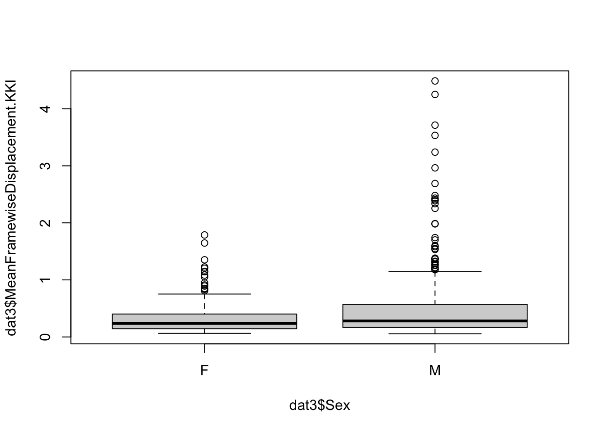

```r
#BRisk
```

Reviewer 1   
These results were used to support the decision to not use any imputation


```r
load('../Data/imputeMotorOverflow/DataWithPropensities_seed1.RData')
```

Compare ADOS scores for children with and without motor overflow (PANESS)  
for ADOS, subset to ASD:


```r
(p.motor.overflow = wilcox.test(ADOS.Comparable.Total~is.na(PANESS.TotalOverflowNotAccountingForAge),data=dat3[dat3$PrimaryDiagnosis=='Autism',]))
```

```
## 
## 	Wilcoxon rank sum test with continuity correction
## 
## data:  ADOS.Comparable.Total by is.na(PANESS.TotalOverflowNotAccountingForAge)
## W = 1037.5, p-value = 0.004907
## alternative hypothesis: true location shift is not equal to 0
```

pull mean differences in ADOS from here:


```r
summary(lm(ADOS.Comparable.Total~is.na(PANESS.TotalOverflowNotAccountingForAge),data=dat3[dat3$PrimaryDiagnosis=='Autism',]))
```

```
## 
## Call:
## lm(formula = ADOS.Comparable.Total ~ is.na(PANESS.TotalOverflowNotAccountingForAge), 
##     data = dat3[dat3$PrimaryDiagnosis == "Autism", ])
## 
## Residuals:
##    Min     1Q Median     3Q    Max 
## -8.227 -3.320 -0.320  2.680 11.680 
## 
## Coefficients:
##                                                    Estimate Std. Error t value
## (Intercept)                                         14.3200     0.3332  42.981
## is.na(PANESS.TotalOverflowNotAccountingForAge)TRUE   2.9073     0.9316   3.121
##                                                    Pr(>|t|)    
## (Intercept)                                         < 2e-16 ***
## is.na(PANESS.TotalOverflowNotAccountingForAge)TRUE  0.00212 ** 
## ---
## Signif. codes:  0 '***' 0.001 '**' 0.01 '*' 0.05 '.' 0.1 ' ' 1
## 
## Residual standard error: 4.08 on 170 degrees of freedom
##   (1 observation deleted due to missingness)
## Multiple R-squared:  0.05419,	Adjusted R-squared:  0.04862 
## F-statistic:  9.74 on 1 and 170 DF,  p-value: 0.002119
```

in the non-imputed data, ADOS is 2.9 higher in the participants missing data


```r
# still present in the remaining 11 children:
sum(is.na(dat3$iPANESS.TotalOverflowNotAccountingForAge))
```

```
## [1] 11
```

```r
summary(lm(ADOS.Comparable.Total~is.na(iPANESS.TotalOverflowNotAccountingForAge),data=dat3[dat3$PrimaryDiagnosis=='Autism',]))
```

```
## 
## Call:
## lm(formula = ADOS.Comparable.Total ~ is.na(iPANESS.TotalOverflowNotAccountingForAge), 
##     data = dat3[dat3$PrimaryDiagnosis == "Autism", ])
## 
## Residuals:
##    Min     1Q Median     3Q    Max 
##   -7.5   -3.5   -0.5    3.5   11.5 
## 
## Coefficients:
##                                                     Estimate Std. Error t value
## (Intercept)                                          14.5000     0.3204  45.249
## is.na(iPANESS.TotalOverflowNotAccountingForAge)TRUE   4.1250     1.4858   2.776
##                                                     Pr(>|t|)    
## (Intercept)                                          < 2e-16 ***
## is.na(iPANESS.TotalOverflowNotAccountingForAge)TRUE  0.00612 ** 
## ---
## Signif. codes:  0 '***' 0.001 '**' 0.01 '*' 0.05 '.' 0.1 ' ' 1
## 
## Residual standard error: 4.104 on 170 degrees of freedom
##   (1 observation deleted due to missingness)
## Multiple R-squared:  0.04337,	Adjusted R-squared:  0.03774 
## F-statistic: 7.707 on 1 and 170 DF,  p-value: 0.006117
```

ADOS is on average 4.12 higher in the children still missing motor overflow after imputation  


```r
wilcox.test(ADOS.Comparable.Total~is.na(iPANESS.TotalOverflowNotAccountingForAge),data=dat3[dat3$PrimaryDiagnosis=='Autism',])
```

```
## 
## 	Wilcoxon rank sum test with continuity correction
## 
## data:  ADOS.Comparable.Total by is.na(iPANESS.TotalOverflowNotAccountingForAge)
## W = 292, p-value = 0.008052
## alternative hypothesis: true location shift is not equal to 0
```

```r
#############################
# other notes on missingness not in RtoR:  
# create a vector of pvalues for six variables: motor overflow, GAI, SES, inattention, hyperactivity, stimulants:   
p.missing.motor = rep(NA,6)
p.missing.motor[1]=p.motor.overflow$p.value

# Look at other variables in Table S.1:
p.missing.motor[2]=wilcox.test(ADOS.Comparable.Total~is.na(WISC.GAI),data=dat3[dat3$PrimaryDiagnosis=='Autism',])$p.value

p.missing.motor[3]=
wilcox.test(ADOS.Comparable.Total~is.na(SES.Family),data=dat3[dat3$PrimaryDiagnosis=='Autism',])$p.value

p.missing.motor[4]=
wilcox.test(ADOS.Comparable.Total~is.na(DuPaulHome.InattentionRaw),data=dat3[dat3$PrimaryDiagnosis=='Autism',])$p.value

p.missing.motor[5]=wilcox.test(ADOS.Comparable.Total~is.na(DuPaulHome.HyperactivityRaw),data=dat3[dat3$PrimaryDiagnosis=='Autism',])$p.value

p.missing.motor[6]=wilcox.test(ADOS.Comparable.Total~is.na(CurrentlyOnStimulants),data=dat3[dat3$PrimaryDiagnosis=='Autism',])$p.value
p.adjust(p.missing.motor,method='BH')
```

```
## [1] 0.02943984 0.14379500 0.89851279 0.74991295 0.74991295 0.70152430
```

```r
# no missing handedness in the ASD group (with ADOS) 
with(dat3, table(PrimaryDiagnosis, is.na(handedness)))
```

```
##                 
## PrimaryDiagnosis FALSE TRUE
##           Autism   173    0
##           None     371    1
```

```r
#wilcox.test(ADOS.Comparable.Total~is.na(handedness),data=dat3[dat3$PrimaryDiagnosis=='Autism',])

# race only missing one observation:  
wilcox.test(ADOS.Comparable.Total~is.na(Race2),data=dat3[dat3$PrimaryDiagnosis=='Autism',])
```

```
## 
## 	Wilcoxon rank sum test with continuity correction
## 
## data:  ADOS.Comparable.Total by is.na(Race2)
## W = 91.5, p-value = 0.9116
## alternative hypothesis: true location shift is not equal to 0
```

```r
############################
#########################
# GAI:  

# create a vector of pvalues for six variables: motor overflow, GAI, SES, inattention, hyperactivity, stimulants:   
p.missing.GAI = rep(NA,5)
p.missing.GAI[1]=wilcox.test(WISC.GAI~is.na(PANESS.TotalOverflowNotAccountingForAge),data=dat3)$p.value

# ADOS is not missing

p.missing.GAI[2]=  wilcox.test(WISC.GAI~is.na(SES.Family),data=dat3)$p.value
# GAI differs by SES.Family missingness 
summary(lm(WISC.GAI~is.na(SES.Family),data=dat3))
```

```
## 
## Call:
## lm(formula = WISC.GAI ~ is.na(SES.Family), data = dat3)
## 
## Residuals:
##     Min      1Q  Median      3Q     Max 
## -39.895  -8.895   0.105  10.105  44.105 
## 
## Coefficients:
##                       Estimate Std. Error t value Pr(>|t|)    
## (Intercept)           112.8945     0.6291 179.441   <2e-16 ***
## is.na(SES.Family)TRUE -11.8279     3.7292  -3.172   0.0016 ** 
## ---
## Signif. codes:  0 '***' 0.001 '**' 0.01 '*' 0.05 '.' 0.1 ' ' 1
## 
## Residual standard error: 14.24 on 525 degrees of freedom
##   (18 observations deleted due to missingness)
## Multiple R-squared:  0.0188,	Adjusted R-squared:  0.01693 
## F-statistic: 10.06 on 1 and 525 DF,  p-value: 0.001604
```

```r
p.missing.GAI[3]= wilcox.test(WISC.GAI~is.na(DuPaulHome.InattentionRaw),data=dat3)$p.value

p.missing.GAI[4]=wilcox.test(WISC.GAI~is.na(DuPaulHome.HyperactivityRaw),data=dat3)$p.value

p.missing.GAI[5]=wilcox.test(WISC.GAI~is.na(CurrentlyOnStimulants),data=dat3[dat3$PrimaryDiagnosis=='Autism',])$p.value

p.adjust(p.missing.GAI,method='BH')
```

```
## [1] 0.2900112 0.0331649 0.4050198 0.4050198 0.2900112
```

Reviewer 3 Q Look at proportions excluded by sex and race  
For this, load the non-imputed data:  


```r
library(mgcv)
```

```
## Loading required package: nlme
```

```
## 
## Attaching package: 'nlme'
```

```
## The following object is masked from 'package:dplyr':
## 
##     collapse
```

```
## This is mgcv 1.8-38. For overview type 'help("mgcv-package")'.
```

```
## 
## Attaching package: 'mgcv'
```

```
## The following object is masked from 'package:arsenal':
## 
##     negbin
```

```r
load('../Data/noImputation/DataWithPropensities_seed1.RData')

with(dat3,table(Delta.KKI,Sex))
```

```
##          Sex
## Delta.KKI   F   M
##         0  19  76
##         1 110 280
```

```r
# Lenient:
# Sex:
fisher.test(with(dat3,table(Delta.KKI,Sex)))
```

```
## 
## 	Fisher's Exact Test for Count Data
## 
## data:  with(dat3, table(Delta.KKI, Sex))
## p-value = 0.1205
## alternative hypothesis: true odds ratio is not equal to 1
## 95 percent confidence interval:
##  0.346744 1.124486
## sample estimates:
## odds ratio 
##  0.6369187
```

```r
# race:
fisher.test(with(dat3,table(Delta.KKI,Race)))
```

```
## 
## 	Fisher's Exact Test for Count Data
## 
## data:  with(dat3, table(Delta.KKI, Race))
## p-value = 0.9597
## alternative hypothesis: two.sided
```

```r
# SES:
summary(gam(Delta.KKI~s(SES.Family),data=dat3,family=binomial))
```

```
## 
## Family: binomial 
## Link function: logit 
## 
## Formula:
## Delta.KKI ~ s(SES.Family)
## 
## Parametric coefficients:
##             Estimate Std. Error z value Pr(>|z|)    
## (Intercept)   1.4127     0.1145   12.34   <2e-16 ***
## ---
## Signif. codes:  0 '***' 0.001 '**' 0.01 '*' 0.05 '.' 0.1 ' ' 1
## 
## Approximate significance of smooth terms:
##               edf Ref.df Chi.sq p-value
## s(SES.Family)   1      1  0.107   0.744
## 
## R-sq.(adj) =  -0.00185   Deviance explained = 0.0224%
## UBRE = -0.0027089  Scale est. = 1         n = 485
```

```r
# Strict:
# sex
fisher.test(with(dat3,table(Ciric_length,Sex)))
```

```
## 
## 	Fisher's Exact Test for Count Data
## 
## data:  with(dat3, table(Ciric_length, Sex))
## p-value = 0.1446
## alternative hypothesis: true odds ratio is not equal to 1
## 95 percent confidence interval:
##  0.4858258 1.1295427
## sample estimates:
## odds ratio 
##  0.7390705
```

```r
# race
fisher.test(with(dat3,table(Ciric_length,Race)))
```

```
## 
## 	Fisher's Exact Test for Count Data
## 
## data:  with(dat3, table(Ciric_length, Race))
## p-value = 0.3619
## alternative hypothesis: two.sided
```

```r
# SES:
dat3$Delta.Ciric = dat3$Ciric_length=="Pass"
summary(gam(Delta.Ciric~s(SES.Family),data=dat3,family=binomial))
```

```
## 
## Family: binomial 
## Link function: logit 
## 
## Formula:
## Delta.Ciric ~ s(SES.Family)
## 
## Parametric coefficients:
##             Estimate Std. Error z value Pr(>|z|)    
## (Intercept) -0.70804    0.09421  -7.515 5.68e-14 ***
## ---
## Signif. codes:  0 '***' 0.001 '**' 0.01 '*' 0.05 '.' 0.1 ' ' 1
## 
## Approximate significance of smooth terms:
##                 edf Ref.df Chi.sq p-value  
## s(SES.Family) 6.958  7.916  13.78  0.0944 .
## ---
## Signif. codes:  0 '***' 0.001 '**' 0.01 '*' 0.05 '.' 0.1 ' ' 1
## 
## R-sq.(adj) =  0.0183   Deviance explained = 2.63%
## UBRE = 0.27229  Scale est. = 1         n = 528
```

```r
####################
###########
```

examine whether motion differs by sex:


```r
library(coin)
```

```
## Loading required package: survival
```

```r
library(rstatix)
```

```
## 
## Attaching package: 'rstatix'
```

```
## The following objects are masked from 'package:coin':
## 
##     chisq_test, friedman_test, kruskal_test, sign_test, wilcox_test
```

```
## The following object is masked from 'package:stats':
## 
##     filter
```

```r
boxplot(dat3$MeanFramewiseDisplacement.KKI~dat3$Sex,dat3[dat3$CompletePredictorCases==1,])
```



```r
# complete predictor cases:
dat3$Sex = as.factor(dat3$Sex)
wilcox.test(MeanFramewiseDisplacement.KKI~Sex,dat3[dat3$CompletePredictorCases==1,])
```

```
## 
## 	Wilcoxon rank sum test with continuity correction
## 
## data:  MeanFramewiseDisplacement.KKI by Sex
## W = 20035, p-value = 0.06486
## alternative hypothesis: true location shift is not equal to 0
```

```r
wilcox_effsize(formula=MeanFramewiseDisplacement.KKI~Sex,data=dat3[dat3$CompletePredictorCases==1,])
```

```
## # A tibble: 1 × 7
##   .y.                           group1 group2 effsize    n1    n2 magnitude
## * <chr>                         <chr>  <chr>    <dbl> <int> <int> <ord>    
## 1 MeanFramewiseDisplacement.KKI F      M       0.0845   129   356 small
```

complete cases lenient pass:


```r
wilcox.test(MeanFramewiseDisplacement.KKI~Sex,dat3[dat3$CompletePredictorCases==1 & dat3$Delta.KKI==1,])
```

```
## 
## 	Wilcoxon rank sum test with continuity correction
## 
## data:  MeanFramewiseDisplacement.KKI by Sex
## W = 14503, p-value = 0.3708
## alternative hypothesis: true location shift is not equal to 0
```

complete cases strict pass:


```r
wilcox.test(MeanFramewiseDisplacement.KKI~Sex,dat3[dat3$CompletePredictorCases==1 & dat3$Delta.Ciric==1,])
```

```
## 
## 	Wilcoxon rank sum test with continuity correction
## 
## data:  MeanFramewiseDisplacement.KKI by Sex
## W = 2415, p-value = 0.1968
## alternative hypothesis: true location shift is not equal to 0
```

